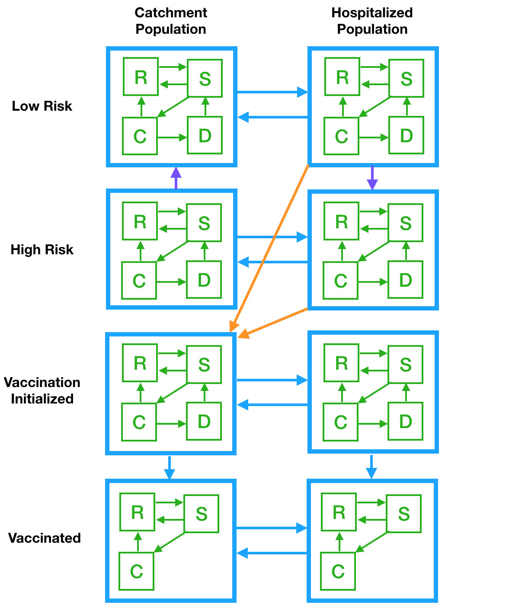

```{r setup, include=FALSE}
knitr::opts_chunk$set(echo = FALSE)
library(tidyverse)
library(deSolve)
```

```{r, out.width='70%', fig.align='center', fig.cap='Movement Model Flow Diagram'}

```

$$
  \begin{aligned}
    {R_1^L}' &= b - d_1R_1^L - \alpha_1^LR_1^L + \theta_1^LS_1^L + \xi_1^LC_1^L -
      (\delta+d_2)N_2\frac{R_1^L}{N_1} +
      (1-\eta_R^Lq_R^L)\delta R_2^L + \rho_R R_1^H\\
    {S_1^L}' &=   - d_1S_1^L + \alpha_1^LR_1^L - (\theta_1^L+\lambda_1^L)S_1^L + p_1^L\varepsilon_1^L D_1^L -
      (\delta+d_2)N_2\frac{S_1^L}{N_1} +
      (1-\eta_S^Lq_S^L)\delta S_2^L + \rho_S S_1^H\\
    {C_1^L}' &=   - d_1C_1^L + \lambda_1^LS_1^L - (\xi_1^L+\phi_1^L)C_1^L -
      (\delta+d_2)N_2\frac{C_1^L}{N_1} +
      (1-\eta_C^Lq_C^L)\delta C_2^L + \rho_C C_1^H\\
    {D_1^L}' &=   - d_1D_1^L + \phi_1^LC_1^L - p_1^L\varepsilon_1^L D_1^L -
      (\delta+d_2)N_2\frac{D_1^L}{N_1} +
      \delta D_2^L + \rho_D D_1^H\\
    \\  
    {R_1^H}' &= - d_1R_1^H - \alpha_1^HR_1^H + \theta_1^HS_1^H + \xi_1^HC_1^H -
      (\delta+d_2)N_2\frac{R_1^H}{N_1} +
      (1-\eta_R^Hq_R^H)\delta R_2^H - \rho_R R_1^H\\
    {S_1^H}' &=   - d_1S_1^H + \alpha_1^HR_1^H - (\theta_1^H+\lambda_1^H)S_1^H + p_1^H\varepsilon_1^H D_1^H -
      (\delta+d_2)N_2\frac{S_1^H}{N_1} +
      (1-\eta_S^Hq_S^H)\delta S_2^H - \rho_S S_1^H\\
    {C_1^H}' &=   - d_1C_1^H + \lambda_1^HS_1^H - (\xi_1^H+\phi_1^H)C_1^H -
      (\delta+d_2)N_2\frac{C_1^H}{N_1} +
      (1-\eta_C^Hq_C^H)\delta C_2^H - \rho_C C_1^H\\
    {D_1^H}' &=   - d_1D_1^H + \phi_1^HC_1^H - p_1^H\varepsilon_1^H D_1^H -
      (\delta+d_2)N_2\frac{D_1^H}{N_1} +
      \delta D_2^H - \rho_D D_1^H\\
    \\  
    {R_1^{V_0}}' &= - d_1R_1^{V_0} - \alpha_1^{V_0}R_1^{V_0} + 
      \theta_1^{V_0}S_1^{V_0} + \xi_1^{V_0}C_1^{V_0} -
      (\delta+d_2)N_2\frac{R_1^{V_0}}{N_1} + \delta R_2^{V_0} + \eta_R^Lq_R^L\delta R_2^L + \eta_R^Hq_R^H\delta R_2^H -
      \nu_R^e R_1^{V_0}\\
    {S_1^{V_0}}' &=   - d_1S_1^{V_0} + \alpha_1^{V_0}R_1^{V_0} - (\theta_1^{V_0}+\lambda_1^{V_0})S_1^{V_0} + p_1^{V_0}\varepsilon_1^{V_0} D_1^{V_0} -
      (\delta+d_2)N_2\frac{S_1^{V_0}}{N_1} + \delta S_2^{V_0} + \eta_S^Lq_S^L\delta S_2^L + \eta_S^Hq_S^H\delta S_2^H -
      \nu_S^e S_1^{V_0}\\
    {C_1^{V_0}}' &= - d_1C_1^{V_0} + \lambda_1^{V_0}S_1^{V_0} - (\xi_1^{V_0}+\phi_1^{V_0})C_1^{V_0} -
      (\delta+d_2)N_2\frac{C_1^{V_0}}{N_1} + \delta C_2^{V_0} + \eta_C^Lq_C^L\delta C_2^L + \eta_C^Hq_C^H\delta C_2^H -
      \nu_C^e C_1^{V_0}\\
    {D_1^{V_0}}' &= - d_1D_1^{V_0} + \phi_1^{V_0}C_1^{V_0} - p_1^{V_0}\varepsilon_1^{V_0} D_1^{V_0} -
      (\delta+d_2)N_2\frac{D_1^{V_0}}{N_1} + \delta D_2^{V_0}\\
    \\
    {R_1^V}' &= - d_1R_1^V - \alpha_1^VR_1^V + \theta_1^VS_1^V + \xi_1^VC_1^V -
      (\delta+d_2)N_2\frac{R_1^V}{N_1} +
      \delta R_2^V + \nu_R^e R_1^{V_0}\\
    {S_1^V}' &= - d_1S_1^V + \alpha_1^VR_1^V - (\theta_1^V+\lambda_1^V)S_1^V -
      (\delta+d_2)N_2\frac{S_1^V}{N_1} +
      \delta S_2^V + \nu_S^e S_1^{V_0}\\
    {C_1^V}' &=   - d_1C_1^V + \lambda_1^VS_1^V - \xi_1^VC_1^V -
      (\delta+d_2)N_2\frac{C_1^V}{N_1} +
      \delta C_2^V + \nu_C^e C_1^{V_0}\\
    \\
    {R_2^L}' &= - d_2R_2^L - \alpha_2^LR_2^L + \theta_2^LS_2^L + \xi_2^LC_2^L +
      (\delta+d_2)N_2\frac{R_1^L}{N_1} -
      \delta R_2^L - r_R R_2^L\\
    {S_2^L}' &= - d_2S_2^L + \alpha_2^LR_2^L - (\theta_2^L+\lambda_2^L)S_2^L + p_2^L\varepsilon_2^L D_2^L +
      (\delta+d_2)N_2\frac{S_1^L}{N_1} -
      \delta S_2^L - r_S S_2^L\\
    {C_2^L}' &= - d_2C_2^L + \lambda_2^LS_2^L - (\xi_2^L+\phi_2^L)C_2^L +
      (\delta+d_2)N_2\frac{C_1^L}{N_1} -
      \delta C_2^L - r_C C_2^L\\
    {D_2^L}' &= - d_2D_2^L + \phi_2^LC_2^L - p_2^L\varepsilon_2^L D_2^L +
      (\delta+d_2)N_2\frac{D_1^L}{N_1} -
      \delta D_2^L - r_D D_2^L\\
    \\  
    {R_2^H}' &= - d_2R_2^H - \alpha_2^HR_2^H + \theta_2^HS_2^H + \xi_2^HC_2^H +
      (\delta+d_2)N_2\frac{R_1^H}{N_1} -
      \delta R_2^H + r_R R_2^L\\
    {S_2^H}' &= - d_2S_2^H + \alpha_2^HR_2^H - (\theta_2^H+\lambda_2^H)S_2^H + p_2^H\varepsilon_2^H D_2^H +
      (\delta+d_2)N_2\frac{S_1^H}{N_1} -
      \delta S_2^H + r_S S_2^L\\
    {C_2^H}' &= - d_2C_2^H + \lambda_2^HS_2^H - (\xi_2^H+\phi_2^H)C_2^H +
      (\delta+d_2)N_2\frac{C_1^H}{N_1} -
      \delta C_2^H + r_C C_2^L\\
    {D_2^H}' &= - d_2D_2^H + \phi_2^HC_2^H - p_2^H\varepsilon_2^H D_2^H +
      (\delta+d_2)N_2\frac{D_1^H}{N_1} -
      \delta D_2^H + r_D D_2^L\\
    \\  
    {R_2^{V_0}}' &= - d_2R_2^{V_0} - \alpha_2^{V_0}R_2^{V_0} + 
      \theta_2^{V_0}S_2^{V_0} + \xi_2^{V_0}C_2^{V_0} +
      (\delta+d_2)N_2\frac{R_1^{V_0}}{N_1} - \delta R_2^{V_0} -
      \nu_R^e R_2^{V_0}\\
    {S_2^{V_0}}' &= - d_2S_2^{V_0} + \alpha_2^{V_0}R_2^{V_0} - (\theta_2^{V_0}+\lambda_2^{V_0})S_2^{V_0} + p_2^{V_0}\varepsilon_2^{V_0} D_2^{V_0} +
      (\delta+d_2)N_2\frac{S_1^{V_0}}{N_1} - \delta S_2^{V_0} -
      \nu_S^e S_2^{V_0}\\
    {C_2^{V_0}}' &= -d_2C_2^{V_0} + \lambda_2^{V_0}S_2^{V_0} - (\xi_2^{V_0}+\phi_2^{V_0})C_2^{V_0} +
      (\delta+d_2)N_2\frac{C_1^{V_0}}{N_1} - \delta C_2^{V_0} -
      \nu_C^e C_2^{V_0}\\
    {D_2^{V_0}}' &= -d_2D_2^{V_0} + \phi_2^{V_0}C_2^{V_0} - p_2^{V_0}\varepsilon_2^{V_0} D_2^{V_0} +
      (\delta+d_2)N_2\frac{D_1^{V_0}}{N_1} - \delta D_2^{V_0}\\
    \\
    {R_2^V}' &= - d_2R_2^V - \alpha_2^VR_2^V + \theta_2^VS_2^V + \xi_2^VC_2^V +
      (\delta+d_2)N_2\frac{R_1^V}{N_1} - \delta R_2^V + 
      \nu_R^e R_2^{V_0}\\
    {S_2^V}' &= - d_2S_2^V + \alpha_2^VR_2^V - (\theta_2^V+\lambda_2^V)S_2^V +
      (\delta+d_2)N_2\frac{S_1^V}{N_1} - \delta S_2^V + 
      \nu_S^e S_2^{V_0}\\
    {C_2^V}' &= - d_2C_2^V + \lambda_2^VS_2^V - \xi_2^VC_2^V +
      (\delta+d_2)N_2\frac{C_1^V}{N_1} - \delta C_2^V + 
      \nu_C^e C_2^{V_0}\\
  \end{aligned}
$$

where

$$\lambda_i^j=\beta_{C,i}^j(C_i^L+C_i^H+C_i^{V_0}+C_i^V) + \beta_{D,i}^j(D_i^L+D_i^H+D_i^{V_0}), i\in\{1,2\}, j\in\{L,H,V_0,V\}$$

and births balance deaths:

$$b=d_1N_1+d_2N_2$$

where

$$N_i=R_i+S_i+C_i+D_i, i=1,2$$

and

$$R_i=R_i^L+R_i^H+R_i^{V_0}+R_i^V, \text{etc.}$$

##### Basic Reproduction Number

We use the next generation matrix method to calculate $\mathscr{R}_0$, the basic reproduction number, for the model without vaccination. Ordering the disease states $C_1^L,C_1^H,C_2^L,C_2^H,D_1^L,D_1^H,D_2^L,D_2^H$, we have: 

$$
  \mathscr{F} = 
  \left[
    \begin{array}
      {c}
      \lambda_1^L S_1^L \\
      \lambda_1^H S_1^H \\
      \lambda_2^L S_2^L \\
      \lambda_2^H S_2^H \\
      0 \\
      0 \\
      0 \\
      0
    \end{array}
  \right] \Rightarrow F =
  \left[
    \begin{array}
      {cccccc}
      \beta_{C,1}^L S_{0,1}^L & \beta_{C,1}^L S_{0,1}^L & 0 &  0 & \beta_{D,1}^L S_{0,1}^L & \beta_{D,1}^L S_{0,1}^L & 0 & 0 \\
      \beta_{C,1}^H S_{0,1}^H & \beta_{C,1}^H S_{0,1}^H & 0 & 0 & \beta_{D,1}^H S_{0,1}^H & \beta_{D,1}^H S_{0,1}^H & 0 & 0 \\
      0 & 0 & \beta_{C,2}^L S_{0,2}^L & \beta_{C,2}^L S_{0,2}^L & 0 & 0 & \beta_{D,2}^L S_{0,2}^L & \beta_{D,2}^L S_{0,2}^L \\
      0 & 0 & \beta_{C,2}^H S_{0,2}^H & \beta_{C,2}^H S_{0,2}^H & 0 & 0 & \beta_{D,2}^H S_{0,2}^H & \beta_{D,2}^H S_{0,2}^H\\
      0 & 0 & 0 & 0 & 0 & 0 & 0 & 0 \\
      0 & 0 & 0 & 0 & 0 & 0 & 0 & 0 \\
      0 & 0 & 0 & 0 & 0 & 0 & 0 & 0 \\
      0 & 0 & 0 & 0 & 0 & 0 & 0 & 0
    \end{array}
  \right] = 
  \left[
    \begin{array}
      {cc}
      \mathbf{B_C} & \mathbf{B_D}\\
      \mathbf{0} & \mathbf{0}
    \end{array}
  \right]
$$

$$
  \mathscr{V} = 
  \left[
    \begin{array}
      {c}
      (d_1+\xi_1^L+\phi_1^L+(\delta+d_2)\frac{N_2}{N_1})C_1^L - \delta C_2^L - \rho_C C_1^H \\
      (d_1+\xi_1^H+\phi_1^H+(\delta+d_2)\frac{N_2}{N_1}+\rho_C)C_1^H - \delta C_2^H \\
      (d_2+\xi_2^L+\phi_2^L+\delta + r_C)C_2^L - (\delta + d_2)\frac{N_2}{N_1}C_1^L \\
      (d_2+\xi_2^H+\phi_2^H+\delta)C_2^H - (\delta + d_2)\frac{N_2}{N_1}C_1^H - r_C C_2^L \\
      (d_1+p_1^L\varepsilon_1^L+(\delta+d_2)\frac{N_2}{N_1})D_1^L - \phi_1^LC_1^L - \delta D_2^L - \rho_D D_1^H \\
      (d_1+p_1^H\varepsilon_1^H+(\delta+d_2)\frac{N_2}{N_1}+\rho_D)D_1^H - \phi_1^HC_1^H - \delta D_2^H \\
      (d_2+p_2^L\varepsilon_2^L+\delta + r_D)D_2^L - \phi_2^LC_2^L - (\delta + d_2)\frac{N_2}{N_1}D_1^L \\
      (d_2+p_2^H\varepsilon_2^H+\delta)D_2^H - \phi_2^HC_2^H - (\delta + d_2)\frac{N_2}{N_1}D_1^H - r_D D_2^L
    \end{array}
  \right] \Rightarrow V =
  \left[
    \begin{array}
      {cc}
      \mathbf{T_C} & \mathbf{0}\\
      \mathbf{-\Phi} & \mathbf{T_D}
    \end{array}
  \right]
$$

where

$$
  \mathbf{\Phi} =
  \left[
    \begin{array}
      {ccc}
       \phi_1^L & 0 & 0 & 0 \\
       0 & \phi_1^H & 0 & 0 \\
       0 & 0 & \phi_2^L & 0 \\
       0 & 0 & 0 & \phi_2^H
    \end{array}
  \right],
$$
$$
  \mathbf{T_C} =
  \left[
    \begin{array}
      {ccc}
      d_1+\xi_1^L+\phi_1^L+(\delta+d_2)\frac{N_2}{N_1} & -\rho_C & -\delta & 0 \\
      0 & d_1+\xi_1^H+\phi_1^H+(\delta+d_2)\frac{N_2}{N_1}+\rho_C & 0 & -\delta \\
      -(\delta+d_2)\frac{N_2}{N_1} & 0 & d_2+\xi_2^L+\phi_2^L+\delta+r_C & 0 \\
      0 & -(\delta+d_2)\frac{N_2}{N_1} & -r_C & d_2+\xi_2^H+\phi_2^H+\delta
    \end{array}
  \right],
$$

and $\mathbf{T_D}$ is similar to $\mathbf{T_C}$. This gives the next generation matrix (NGM),

$$
  FV^{-1} =
  \left[
    \begin{array}
      {cc}
      \mathbf{B_C} & \mathbf{B_D}\\
      \mathbf{0} & \mathbf{0}
    \end{array}
  \right]
  \left[
    \begin{array}
      {cc}
      \mathbf{T_C}^{-1} & \mathbf{0}\\
      \mathbf{T_D}^{-1}\mathbf{\Phi}\mathbf{T_C}^{-1} & \mathbf{T_D}^{-1}
    \end{array}
  \right] =
  \left[
    \begin{array}
      {cc}
      (\mathbf{B_C}+\mathbf{B_D}\mathbf{T_D}^{-1}\mathbf{\Phi})\mathbf{T_C}^{-1} & \mathbf{B_D}\mathbf{T_D}^{-1}\\
      \mathbf{0} & \mathbf{0}
    \end{array}
  \right].
$$

The basic reproduction number, $\mathscr{R}_0$, is the spectral radius of the NGM:

$$
  \mathscr{R}_0 = \rho(FV^{-1})=\rho((\mathbf{B_C}+\mathbf{B_D}\mathbf{T_D}^{-1}\mathbf{\Phi})\mathbf{T_C}^{-1}).
$$

If $\rho_C=\rho_D=0$, then it is straightforward to calculate $\mathbf{T_C}^{-1}$ and $\mathbf{T_D}^{-1}$ explicitly. Actually, I have calculated $\mathbf{T_C}^{-1}$ and $\mathbf{T_D}^{-1}$ for the general case--see written notes dated June 6.

|Parameter|Description|Baseline Value| 
|:---|:---|:---|
|$N_1$|Community population size|100000|
|$N_2$|Hospital population size|2000|
|$b$|Community births per day|$d_1N_1 + d_2N_2$|
|$d_1$|Community death rate|1/(78.5*365)|
|$d_2$|Hospital death rate|0.0068|
|$\alpha_1^*$|Community antibiotic prescription rates|0.5/50|
|$\alpha_2^*$|Hospital antibiotic prescription rates|0.5|
|$\theta_1^*$|Community resistance restoration rates (susceptibles)|0.033|
|$\theta_2^*$|Hospital resistance restoration rates (susceptibles)|0.033|
|$\xi_1^*$|Community resistance restoration rates (colonized)|0.033/2|
|$\xi_2^*$|Hospital resistance restoration rates (colonized)|0.033/2|
|$\beta_{C,1}^*$|Carrier transmission coefficient (community)|0.007/50|
|$\beta_{D,1}^*$|Diseased transmission coefficient (community)|0.007/50|
|$\beta_{C,2}^*$|Carrier transmission coefficient (hospital)|0.007|
|$\beta_{D,2}^*$|Diseased transmission coefficient (hospital)|0.007|
|$\phi_1^*$|Community disease rates|0.2|
|$\phi_2^*$|Hospital disease rates|0.2|
|$p_1^*$|Community probability of successful treatment|0.8|
|$p_2^*$|Hospital probability of successful treatment|0.8|
|$\varepsilon_1^*$|Community treatment rates|0.1|
|$\varepsilon_2^*$|Hospital treatment rates|0.1|
|$\eta_*^*$|Vaccination levels|0.25|
|$q_*^*$|Probabilities that vaccination will be successful|1.0|
|$\rho_*$|High to low risk transition rates|0.001|
|$\nu_*^e$|Effective vaccination rates|2/365|
|$r_*$|Low to high risk transition rates |0.01|
|$\delta$|Discharge rate|0.135|


```{r, echo = FALSE, include = FALSE}
library(tidyverse)
library(deSolve)

cdiff_metapop_vacc <- function(t, state, parameters) {
  with(as.list(c(state, parameters)),
       {
         sumC1 <- C1L+C1H+C1V0+C1V
         sumD1 <- D1L+D1H+D1V0
         
         lambda1L <- betaC1L*sumC1 + betaD1L*sumD1
         lambda1H <- betaC1H*sumC1 + betaD1H*sumD1
         lambda1V0 <- betaC1V0*sumC1 + betaD1V0*sumD1
         lambda1V <- betaC1V*sumC1 + betaD1V*sumD1
         
         sumC2 <- C2L+C2H+C2V0+C2V
         sumD2 <- D2L+D2H+D2V0
         
         lambda2L <- betaC2L*sumC2 + betaD2L*sumD2
         lambda2H <- betaC2H*sumC2 + betaD2H*sumD2
         lambda2V0 <- betaC2V0*sumC2 + betaD2V0*sumD2
         lambda2V <- betaC2V*sumC2 + betaD2V*sumD2
         
         dR1L <- b - (d1+alpha1L+(delta+d2)*N2/N1)*R1L + theta1L*S1L + xi1L*C1L + (1-etaRL*qRL)*delta*R2L + rhoR*R1H
         dS1L <-   - (d1+theta1L+lambda1L+(delta+d2)*N2/N1)*S1L + alpha1L*R1L + p1L*eps1L*D1L + (1-etaSL*qSL)*delta*S2L + rhoS*S1H
         dC1L <-   - (d1+xi1L+phi1L+(delta+d2)*N2/N1)*C1L + lambda1L*S1L + (1-etaCL*qCL)*delta*C2L + rhoC*C1H
         dD1L <-   - (d1+p1L*eps1L+(delta+d2)*N2/N1)*D1L + phi1L*C1L + delta*D2L + rhoD*D1H
           
         dR1H <-  - (d1+alpha1H+(delta+d2)*N2/N1)*R1H + theta1H*S1H + xi1H*C1H + (1-etaRH*qRH)*delta*R2H - rhoR*R1H
         dS1H <-  - (d1+theta1H+lambda1H+(delta+d2)*N2/N1)*S1H + alpha1H*R1H + p1H*eps1H*D1H + (1-etaSH*qSH)*delta*S2H - rhoS*S1H
         dC1H <-  - (d1+xi1H+phi1H+(delta+d2)*N2/N1)*C1H + lambda1H*S1H + (1-etaCH*qCH)*delta*C2H - rhoC*C1H
         dD1H <-  - (d1+p1H*eps1H+(delta+d2)*N2/N1)*D1H + phi1H*C1H + delta*D2H - rhoD*D1H
          
         dR1V0 <- - (d1+alpha1V0+(delta+d2)*N2/N1+nuR)*R1V0 + theta1V0*S1V0 + xi1V0*C1V0 + delta*(R2V0+etaRL*qRL*R2L+etaRH*qRH*R2H)
         dS1V0 <- - (d1+theta1V0+lambda1V0+(delta+d2)*N2/N1+nuS)*S1V0 + alpha1V0*R1V0 + p1V0*eps1V0*D1V0 + delta*(S2V0+etaSL*qSL*S2L+etaSH*qSH*S2H)
         dC1V0 <- - (d1+xi1V0+phi1V0+(delta+d2)*N2/N1+nuC)*C1V0 + lambda1V0*S1V0 + delta*(C2V0+etaCL*qCL*C2L+etaCH*qCH*C2H)
         dD1V0 <- - (d1+p1V0*eps1V0+(delta+d2)*N2/N1)*D1V0 + phi1V0*C1V0 + delta*D2V0
         
         dR1V <-  - (d1+alpha1V+(delta+d2)*N2/N1)*R1V + theta1V*S1V + xi1V*C1V + delta*R2V + nuR*R1V0
         dS1V <-  - (d1+theta1V+lambda1V+(delta+d2)*N2/N1)*S1V + alpha1V*R1V + delta*S2V + nuS*S1V0
         dC1V <-  - (d1+xi1V+(delta+d2)*N2/N1)*C1V + lambda1V*S1V + delta*C2V + nuC*C1V0
         
         dR2L <-   - (d2+alpha2L+delta)*R2L + theta2L*S2L + xi2L*C2L + (1-rR)*(delta+d2)*N2/N1*R1L
         dS2L <-   - (d2+theta2L+lambda2L+delta)*S2L + alpha2L*R2L + p2L*eps2L*D2L + (1-rS)*(delta+d2)*N2/N1*S1L
         dC2L <-   - (d2+xi2L+phi2L+delta)*C2L + lambda2L*S2L + (1-rC)*(delta+d2)*N2/N1*C1L
         dD2L <-   - (d2+p2L*eps2L+delta)*D2L + phi2L*C2L + (1-rD)*(delta+d2)*N2/N1*D1L
         
         dR2H <-  - (d2+alpha2H+delta)*R2H + theta2H*S2H + xi2H*C2H + (delta+d2)*N2/N1*(rR*R1L+R1H)
         dS2H <-  - (d2+theta2H+lambda2H+delta)*S2H + alpha2H*R2H + p2H*eps2H*D2H + (delta+d2)*N2/N1*(rS*S1L+S1H)
         dC2H <-  - (d2+xi2H+phi2H+delta)*C2H + lambda2H*S2H + (delta+d2)*N2/N1*(rC*C1L+C1H)
         dD2H <-  - (d2+p2H*eps2H+delta)*D2H + phi2H*C2H + (delta+d2)*N2/N1*(rD*D1L+D1H)
         
         dR2V0 <- - (d2+alpha2V0+delta+nuR)*R2V0 + theta2V0*S2V0 + xi2V0*C2V0 + (delta+d2)*N2/N1*R1V0
         dS2V0 <- - (d2+theta2V0+lambda2V0+delta+nuS)*S2V0 + alpha2V0*R2V0 + p2V0*eps2V0*D2V0 + (delta+d2)*N2/N1*S1V0
         dC2V0 <- - (d2+xi2V0+phi2V0+delta+nuC)*C2V0 + lambda2V0*S2V0 + (delta+d2)*N2/N1*C1V0
         dD2V0 <- - (d2+p2V0*eps2V0+delta)*D2V0 + phi2V0*C2V0 + (delta+d2)*N2/N1*D1V0
         
         dR2V <-  - (d2+alpha2V+delta)*R2V + theta2V*S2V + xi2V*C2V + nuR*R2V0 + (delta+d2)*N2/N1*R1V
         dS2V <-  - (d2+theta2V+lambda2V+delta)*S2V + alpha2V*R2V + nuS*S2V0 + (delta+d2)*N2/N1*S1V
         dC2V <-  - (d2+xi2V+delta)*C2V + lambda2V*S2V + nuC*C2V0 + (delta+d2)*N2/N1*C1V
         
         list(c(dR1L, dS1L, dC1L, dD1L, dR1H, dS1H, dC1H, dD1H, dR1V0, dS1V0, dC1V0, dD1V0, dR1V, dS1V, dC1V, dR2L, dS2L, dC2L, dD2L, dR2H, dS2H, dC2H, dD2H, dR2V0, dS2V0, dC2V0, dD2V0, dR2V, dS2V, dC2V))
       })
}

N1 <- 100000
N2 <- 10000
d1 <- 1/(78.5*365)
d2 <- .0068
b <- d1*N1 + d2*N2


parameters <- c(N1 = N1, N2 = N2, d1 = d1, d2 = d2, b = b,
                
                alpha1L = 0.5/50, theta1L = 0.033, xi1L = 0.0165, phi1L = 0.2, 
                p1L = 0.8, eps1L = 0.1, betaC1L = 0.007/50, betaD1L = 0.007/50,
                
                alpha1H = 0.5/50, theta1H = 0.033, xi1H = 0.0165, phi1H = 0.2, 
                p1H = 0.8, eps1H = 0.1, betaC1H = 0.007/50, betaD1H = 0.007/50,
                
                alpha1V0 = 0.5/50, theta1V0 = 0.033, xi1V0 = 0.0165, phi1V0 = 0.2, 
                p1V0 = 0.8, eps1V0 = 0.1, betaC1V0 = 0.007/50, betaD1V0 = 0.007/50,
                
                alpha1V = 0.5/50, theta1V = 0.033, xi1V = 0.0165, 
                betaC1V = 0.007/50, betaD1V = 0.007/50,
                
                alpha2L = 0.5, theta2L = 0.033, xi2L = 0.0165, phi2L = 0.2, 
                p2L = 0.8, eps2L = 0.1, betaC2L = 0.007, betaD2L = 0.007,
                
                alpha2H = 0.5, theta2H = 0.033, xi2H = 0.0165, phi2H = 0.2, 
                p2H = 0.8, eps2H = 0.1, betaC2H = 0.007, betaD2H = 0.007,
                
                alpha2V0 = 0.5, theta2V0 = 0.033, xi2V0 = 0.0165, phi2V0 = 0.2, 
                p2V0 = 0.8, eps2V0 = 0.1, betaC2V0 = 0.007, betaD2V0 = 0.007,
                
                alpha2V = 0.5, theta2V = 0.033, xi2V = 0.0165, 
                betaC2V = 0.007, betaD2V = 0.007,
                
                etaRL = 1, qRL = 0.25, etaSL = 1, qSL = 0.25, etaCL = 1, qCL = 0.25,
                etaRH = 1, qRH = 0.25, etaSH = 1, qSH = 0.25, etaCH = 1, qCH = 0.25,
                rR = 0.25, rS = 0.25, rC = 0.25, rD = 0.25,
                nuR = 2/365, nuS = 2/365, nuC = 2/365,
                rhoR = 0.001, rhoS = 0.001, rhoC = 0.001, rhoD = 0.001,
                delta = 0.135)

state <- c(R1L = 0.63*N1, S1L = 0.18*N1, C1L = 0.063*N1, D1L = 0.027*N1,
           R1H = 0.07*N1, S1H = 0.02*N1, C1H = 0.007*N1, D1H = 0.003*N1,
           R1V0 = 0, S1V0 = 0, C1V0 = 0, D1V0 = 0,
           R1V = 0, S1V = 0, C1V = 0,
           
           R2L = 0.63*N2, S2L = 0.18*N2, C2L = 0.063*N2, D2L = 0.027*N2,
           R2H = 0.07*N2, S2H = 0.02*N2, C2H = 0.007*N2, D2H = 0.003*N2,
           R2V0 = 0, S2V0 = 0, C2V0 = 0, D2V0 = 0,
           R2V = 0, S2V = 0, C2V = 0)

t <- seq(0, 1100, length = 1000)

cdiff_df <- ode(
  y = state, time = t, 
  func = cdiff_metapop_vacc, 
  parms = parameters) %>%
  unclass() %>% 
  as_tibble() %>%
  gather(func, val, -time) %>% 
  separate(func, into = c("state", "population", "risk"), sep = c(1,2)) %>% 
  mutate(state = factor(state, levels = c("R", "S", "C", "D")),
         population = factor(population, levels = c("1", "2")),
         population = fct_recode(population, catchment = "1", hospitalized = "2"),
         risk = factor(risk, levels = c("L", "H", "V0", "V")))

p <- cdiff_df %>% 
  ggplot(aes(time, val, col = state)) + geom_line() 

p + 
  facet_wrap(vars(risk, population), scales = "free", nrow = 4, labeller = label_context)
```

