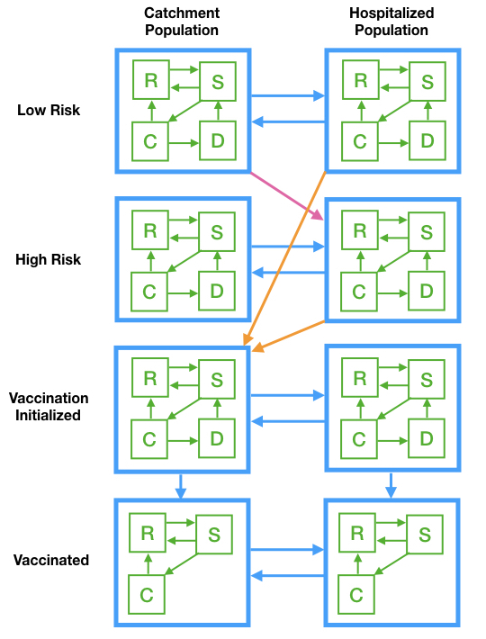

```{r setup, include=FALSE}
knitr::opts_chunk$set(echo = FALSE)
library(tidyverse)
library(deSolve)
```

```{r, out.width='65%', fig.align='center', fig.cap='Movement Model Flow Diagram'}

```

$$
  \begin{aligned}
    {R_1^L}' &= b - d_1R_1^L - \alpha_1^LR_1^L + \theta_1^LS_1^L + \xi_1^LC_1^L -
      (\delta+d_2)N_2\frac{R_1^L}{N_1} +
      (1-q^L)\delta R_2^L\\
    {S_1^L}' &=   - d_1S_1^L + \alpha_1^LR_1^L - (\theta_1^L+\lambda_1^L)S_1^L + p_1^L\varepsilon_1^L D_1^L -
      (\delta+d_2)N_2\frac{S_1^L}{N_1} +
      (1-q^L)\delta S_2^L\\
    {C_1^L}' &=   - d_1C_1^L + \lambda_1^LS_1^L - (\xi_1^L+\phi_1^L)C_1^L -
      (\delta+d_2)N_2\frac{C_1^L}{N_1} +
      (1-q^L)\delta C_2^L\\
    {D_1^L}' &=   - d_1D_1^L + \phi_1^LC_1^L - p_1^L\varepsilon_1^L D_1^L -
      (\delta+d_2)N_2\frac{D_1^L}{N_1} +
      \delta D_2^L\\
    \\  
    {R_1^H}' &= - d_1R_1^H - \alpha_1^HR_1^H + \theta_1^HS_1^H + \xi_1^HC_1^H -
      (\delta+d_2)N_2\frac{R_1^H}{N_1} +
      (1-q^H)\delta R_2^H\\
    {S_1^H}' &=   - d_1S_1^H + \alpha_1^HR_1^H - (\theta_1^H+\lambda_1^H)S_1^H + p_1^H\varepsilon_1^H D_1^H -
      (\delta+d_2)N_2\frac{S_1^H}{N_1} +
      (1-q^H)\delta S_2^H\\
    {C_1^H}' &=   - d_1C_1^H + \lambda_1^HS_1^H - (\xi_1^H+\phi_1^H)C_1^H -
      (\delta+d_2)N_2\frac{C_1^H}{N_1} +
      (1-q^H)\delta C_2^H\\
    {D_1^H}' &=   - d_1D_1^H + \phi_1^HC_1^H - p_1^H\varepsilon_1^H D_1^H -
      (\delta+d_2)N_2\frac{D_1^H}{N_1} +
      \delta D_2^H\\
    \\  
    {R_1^{V_0}}' &= - d_1R_1^{V_0} - \alpha_1^{V_0}R_1^{V_0} + 
      \theta_1^{V_0}S_1^{V_0} + \xi_1^{V_0}C_1^{V_0} -
      (\delta+d_2)N_2\frac{R_1^{V_0}}{N_1} + \delta R_2^{V_0} + q^L\delta R_2^L + q^H\delta R_2^H -
      \nu_e R_1^{V_0}\\
    {S_1^{V_0}}' &=   - d_1S_1^{V_0} + \alpha_1^{V_0}R_1^{V_0} - (\theta_1^{V_0}+\lambda_1^{V_0})S_1^{V_0} + p_1^{V_0}\varepsilon_1^{V_0} D_1^{V_0} -
      (\delta+d_2)N_2\frac{S_1^{V_0}}{N_1} + \delta S_2^{V_0} + q^L\delta S_2^L + q^H\delta S_2^H -
      \nu_e S_1^{V_0}\\
    {C_1^{V_0}}' &= - d_1C_1^{V_0} + \lambda_1^{V_0}S_1^{V_0} - (\xi_1^{V_0}+\phi_1^{V_0})C_1^{V_0} -
      (\delta+d_2)N_2\frac{C_1^{V_0}}{N_1} + \delta C_2^{V_0} + q^L\delta C_2^L + q^H\delta C_2^H -
      \nu_e C_1^{V_0}\\
    {D_1^{V_0}}' &= - d_1D_1^{V_0} + \phi_1^{V_0}C_1^{V_0} - p_1^{V_0}\varepsilon_1^{V_0} D_1^{V_0} -
      (\delta+d_2)N_2\frac{D_1^{V_0}}{N_1} + \delta D_2^{V_0}\\
    \\
    {R_1^V}' &= - d_1R_1^V - \alpha_1^VR_1^V + \theta_1^VS_1^V + \xi_1^VC_1^V -
      (\delta+d_2)N_2\frac{R_1^V}{N_1} +
      \delta R_2^V + \nu_e R_1^{V_0}\\
    {S_1^V}' &= - d_1S_1^V + \alpha_1^VR_1^V - (\theta_1^V+\lambda_1^V)S_1^V -
      (\delta+d_2)N_2\frac{S_1^V}{N_1} +
      \delta S_2^V + \nu_e S_1^{V_0}\\
    {C_1^V}' &=   - d_1C_1^V + \lambda_1^VS_1^V - \xi_1^VC_1^V -
      (\delta+d_2)N_2\frac{C_1^V}{N_1} +
      \delta C_2^V + \nu_e C_1^{V_0}\\
    \\
    {R_2^L}' &= - d_2R_2^L - \alpha_2^LR_2^L + \theta_2^LS_2^L + \xi_2^LC_2^L +
      (1-r)(\delta+d_2)N_2\frac{R_1^L}{N_1} -
      \delta R_2^L\\
    {S_2^L}' &= - d_2S_2^L + \alpha_2^LR_2^L - (\theta_2^L+\lambda_2^L)S_2^L + p_2^L\varepsilon_2^L D_2^L +
      (1-r)(\delta+d_2)N_2\frac{S_1^L}{N_1} -
      \delta S_2^L\\
    {C_2^L}' &= - d_2C_2^L + \lambda_2^LS_2^L - (\xi_2^L+\phi_2^L)C_2^L +
      (1-r)(\delta+d_2)N_2\frac{C_1^L}{N_1} -
      \delta C_2^L\\
    {D_2^L}' &= - d_2D_2^L + \phi_2^LC_2^L - p_2^L\varepsilon_2^L D_2^L +
      (1-r)(\delta+d_2)N_2\frac{D_1^L}{N_1} -
      \delta D_2^L\\
    \\  
    {R_2^H}' &= - d_2R_2^H - \alpha_2^HR_2^H + \theta_2^HS_2^H + \xi_2^HC_2^H +
      r(\delta+d_2)N_2\frac{R_1^L}{N_1} + (\delta+d_2)N_2\frac{R_1^H}{N_1} -
      \delta R_2^H\\
    {S_2^H}' &= - d_2S_2^H + \alpha_2^HR_2^H - (\theta_2^H+\lambda_2^H)S_2^H + p_2^H\varepsilon_2^H D_2^H +
      r(\delta+d_2)N_2\frac{S_1^L}{N_1} + (\delta+d_2)N_2\frac{S_1^H}{N_1} -
      \delta S_2^H\\
    {C_2^H}' &= - d_2C_2^H + \lambda_2^HS_2^H - (\xi_2^H+\phi_2^H)C_2^H +
      r(\delta+d_2)N_2\frac{C_1^L}{N_1} + (\delta+d_2)N_2\frac{C_1^H}{N_1} -
      \delta C_2^H\\
    {D_2^H}' &= - d_2D_2^H + \phi_2^HC_2^H - p_2^H\varepsilon_2^H D_2^H +
      r(\delta+d_2)N_2\frac{D_1^L}{N_1} + (\delta+d_2)N_2\frac{D_1^H}{N_1} -
      \delta D_2^H\\
    \\  
    {R_2^{V_0}}' &= - d_2R_2^{V_0} - \alpha_2^{V_0}R_2^{V_0} + 
      \theta_2^{V_0}S_2^{V_0} + \xi_2^{V_0}C_2^{V_0} +
      (\delta+d_2)N_2\frac{R_1^{V_0}}{N_1} - \delta R_2^{V_0} -
      \nu_e R_2^{V_0}\\
    {S_2^{V_0}}' &= - d_2S_2^{V_0} + \alpha_2^{V_0}R_2^{V_0} - (\theta_2^{V_0}+\lambda_2^{V_0})S_2^{V_0} + p_2^{V_0}\varepsilon_2^{V_0} D_2^{V_0} +
      (\delta+d_2)N_2\frac{S_1^{V_0}}{N_1} - \delta S_2^{V_0} -
      \nu_e S_2^{V_0}\\
    {C_2^{V_0}}' &= -d_2C_2^{V_0} + \lambda_2^{V_0}S_2^{V_0} - (\xi_2^{V_0}+\phi_2^{V_0})C_2^{V_0} +
      (\delta+d_2)N_2\frac{C_1^{V_0}}{N_1} - \delta C_2^{V_0} -
      \nu_e C_2^{V_0}\\
    {D_2^{V_0}}' &= -d_2D_2^{V_0} + \phi_2^{V_0}C_2^{V_0} - p_2^{V_0}\varepsilon_2^{V_0} D_2^{V_0} +
      (\delta+d_2)N_2\frac{D_1^{V_0}}{N_1} - \delta D_2^{V_0}\\
    \\
    {R_2^V}' &= - d_2R_2^V - \alpha_2^VR_2^V + \theta_2^VS_2^V + \xi_2^VC_2^V +
      (\delta+d_2)N_2\frac{R_1^V}{N_1} - \delta R_2^V + 
      \nu_e R_2^{V_0}\\
    {S_2^V}' &= - d_2S_2^V + \alpha_2^VR_2^V - (\theta_2^V+\lambda_2^V)S_2^V +
      (\delta+d_2)N_2\frac{S_1^V}{N_1} - \delta S_2^V + 
      \nu_e S_2^{V_0}\\
    {C_2^V}' &= - d_2C_2^V + \lambda_2^VS_2^V - \xi_2^VC_2^V +
      (\delta+d_2)N_2\frac{C_1^V}{N_1} - \delta C_2^V + 
      \nu_e C_2^{V_0}\\
  \end{aligned}
$$

where

$$\lambda_i^j=\beta_{C,i}^j(C_i^L+C_i^H+C_i^{V_0}+C_i^V) + \beta_{D,i}^j(D_i^L+D_i^H+D_i^{V_0}), i\in\{1,2\}, j\in\{L,H,V_0,V\}$$

and births balance deaths:

$$b=d_1N_1+d_2N_2$$

where

$$N_i=R_i+S_i+C_i+D_i, i=1,2$$

and

$$R_i=R_i^L+R_i^H+R_i^{V_0}+R_i^V, \text{etc.}$$