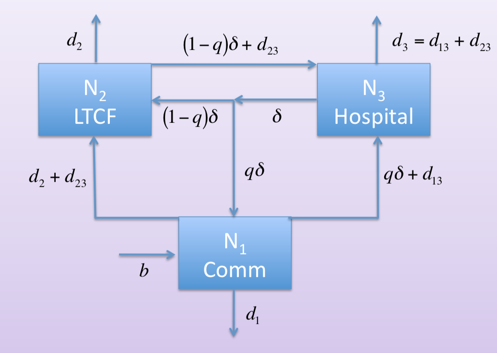

```{r setup, include=FALSE}
knitr::opts_chunk$set(echo = FALSE)
library(tidyverse)
library(deSolve)
```

Lanzas et al. (2011) developed and analyzed an ODE model for *C. difficile* transmission within a medical ward. A key result was that within-ward transmission alone cannot sustain new *C. difficile* colonizations and, so, the *admission* of colonized patients plays an important role in transmission. Community and assisted living populations can interact with hospital populations in complex and important ways and, so, one way to study transmission pathways beyond the level of the ward is to incorporate these populations into the model explicitly. 

Consider the way that patients are admitted and discharged in the hospital-only model:[^1] 

[^1]: I have combined into one state, $C$, what were two separare states, $C^-$ and $C^+$.

$$
  \begin{aligned}
    R' &= a_R\delta N - \alpha R + \theta S- k_RR\\
    S' &= a_S\delta N + \alpha R - \theta S - \lambda S + p\varepsilon D - k_SS\\
    C' &= a_C\delta N - \phi C + \lambda S- k_CC\\
    D' &= a_D\delta N + \phi C - p\varepsilon D - k_DD
  \end{aligned}
$$

where $a_R,a_S,a_C,$ and $a_D$ are admission class proportions so that 

$$a_R+a_S+a_C+a_D=1$$

and $k_R,k_S,k_C,$ and $k_D$ are discharge rates with

$$k_RR+k_SS+k_CC+k_DD=\delta N.$$

In particular, $\delta =\delta (t)$ varies with respect to time in such a way as to balance discharges and admissions. A simple illustration of this is shown here: 

```{r, cache = TRUE}
cdiff_2011 <- function(t, state, parameters) {
  with(as.list(c(state, parameters)),
        {
          deltaN <- kR*R + kS*S + kC*C + kD*D
          lambda <- betaC*C + betaD*D
          dR <- aR*deltaN + theta*S - kR*R - alpha*R
          dS <- aS*deltaN + alpha*R + p*eps*D - (theta+kS+lambda)*S
          dC <- aC*deltaN + lambda*S - (phi+kC)*C
          dD <- aD*deltaN + phi*C - (p*eps+kD)*D
          list(c(dR, dS, dC, dD))
        })
}

parameters <- c(aR = 0.75, aS = 0.22, aC = 0.02, aD = 0.01, 
                kR = 0.33, kS = 0.15, kC = 0.15, kD = 0.068,
                alpha = 0.5, theta = 0.0033, phi = 0.2, p = 0.8, eps = 0.10,
                betaC = 0.007, betaD = 0.007)
N <- 200
state <- c(R = 0.7*N, S = 0.2*N, C = 0.07*N, D = 0.03*N)
t <- seq(0, 20, length = 1000)

cdiff_df <- ode(y = state, time = t, func = cdiff_2011, parms = parameters) %>%
  unclass() %>% 
  as_tibble() %>%
  mutate(
    deltaN = parameters["kR"]*R + parameters["kS"]*S + parameters["kC"]*C + parameters["kD"]*D
    ) %>%
  gather(func, val, -time) %>% 
  mutate(func = factor(func, levels = c("R", "S", "C", "D", "deltaN")))

cdiff_df %>% 
  ggplot(aes(time, val, col = func)) + 
  geom_line()
```

This isn't to suggest that such a constraint on $\delta(t)$ is a problem. In fact, $\delta (t)$ approaches an equilibrium value as the states approach equilibrium:

$$\delta '=\frac{k_RR'+k_SS'+k_CC'+k_DD'}{N}.$$

This approach has the benefit that both the admission *proportions* and the discharge *rates* can be estimated from data. There may be good reasons, however, to choose a different perspective when explicitly modeling the source population(s) of hospital patients. 

For example, in terms of the admission of new patients, the model assumes that the source population has, at any time, a sufficient number of individuals from each state to supply the admission class. This assumption is reasonable for source populations that are large relative to the hospital and that are not being modeled explicitly. 

Neither of these assumptions hold when we incorporate the community and other healthcare related facilities. That is to say that, in the community context, admissions to the hospital represent departures from somewhere else! Care must be taken to ensure positive invariance of the system.

The model I have proposed regards $\delta$ as a constant with respect to time and regards all admission and discharge parameters as time-varying proportions that reflect the (appropriate) proportions of the source population. 

The movement model here has three patches. Patch one is the community, patch two is a ~~LTCF~~ nursing home, and patch three is a hospital.

```{r, out.width='55%', fig.align='center', fig.cap='Movement Model Flow Diagram'}

```

The equations for the movement model:

$$
  \begin{aligned}
    N_1' &= b - d_1N_1 - d_2N_2 - d_{23}N_3 + q\delta N_3 -                (q\delta+d_{13})N_3\\
    N_2' &= d_2N_2 + d_{23}N_3 - d_2N_2 - ((1-q)\delta+d_{23})N_3 +        (1-q)\delta N_3\\
    N_3' &= (q\delta+d_{13})N_3 - \delta N_3 +                             ((1-q)\delta+d_{23})N_3 - (d_{13}+d_{23})N_3
  \end{aligned}
$$

where community births, $b$, are chosen to balance all deaths:

$$b=d_1N_1 + d_2N_2 + (d_{13}+d_{23})N_3.$$

It is easy to see by inspection that each patch population remains constant.

Within-patch dynamics are similar to the previous but now include demography as well as one change to the epidemiology (C can move to R). 

$$
  \begin{aligned}
    R_1' &= b - (d_1^R+\alpha_1)R_1 + \theta_1S_1 + \xi_1C_1 +
      k_{31}^R(q\delta N_3) - 
      a_{13}^R(q\delta+d_{13})N_3 - 
      a_{12}^R(d_2N_2+d_{23}N_3)\\
    S_1' &= -(d_1^S+\theta_1+\lambda_1)S_1 + \alpha_1R_1 + p_1\varepsilon_1D_1 +
      k_{31}^S(q\delta N_3) - 
      a_{13}^S(q\delta+d_{13})N_3 - 
      a_{12}^S(d_2N_2+d_{23}N_3)\\
    C_1' &= -(d_1^C+\phi_1+\xi_1)C_1 + \lambda_1S_1 +
      k_{31}^C(q\delta N_3) - 
      a_{13}^C(q\delta+d_{13})N_3 - 
      a_{12}^C(d_2N_2+d_{23}N_3)\\
    D_1' &= -(d_1^D+p_1\varepsilon_1)D_1 + \phi_1C_1 +
      k_{31}^D(q\delta N_3) - 
      a_{13}^D(q\delta+d_{13})N_3 - 
      a_{12}^D(d_2N_2+d_{23}N_3)\\
    \\
    R_2' &= - (d_2^R+\alpha_2)R_2 + \theta_2S_2 + \xi_2C_2 +
      k_{32}^R(1-q)\delta N_3 - 
      a_{23}^R((1-q)\delta+d_{23})N_3 +
      a_{12}^R(d_2N_2+d_{23}N_3)\\
    S_2' &= -(d_2^S+\theta_2+\lambda_2)S_2 + \alpha_2R_2 + p_2\varepsilon_2D_2 +
      k_{32}^S(1-q)\delta N_3 - 
      a_{23}^S((1-q)\delta+d_{23})N_3 +
      a_{12}^S(d_2N_2+d_{23}N_3)\\
    C_2' &= -(d_2^C+\phi_2+\xi_2)C_2 + \lambda_2S_2 +
      k_{32}^C(1-q)\delta N_3 - 
      a_{23}^C((1-q)\delta+d_{23})N_3 +
      a_{12}^C(d_2N_2+d_{23}N_3)\\
    D_2' &= -(d_2^D+p_2\varepsilon_2)D_2 + \phi_2C_2 +
      k_{32}^D(1-q)\delta N_3 - 
      a_{23}^D((1-q)\delta+d_{23})N_3 +
      a_{12}^D(d_2N_2+d_{23}N_3)\\
    \\
    R_3' &= - (d_{13}^R+d_{23}^R+\alpha_3)R_3 + \theta_3S_3 + \xi_3C_3 +
      a_{13}^R(q\delta+d_{13})N_3 + 
      a_{23}^R((1-q)\delta+d_{23})N_3 -
      k_{31}^R(q\delta N_3) -
      k_{32}^R(1-q)\delta N_3\\
    S_3' &= -(d_{13}^S+d_{23}^S+\theta_3+\lambda_3)S_3 + \alpha_3R_3 + p_3\varepsilon_3D_3 +
      a_{13}^S(q\delta+d_{13})N_3 + 
      a_{23}^S((1-q)\delta+d_{23})N_3 -
      k_{31}^S(q\delta N_3) -
      k_{32}^S(1-q)\delta N_3\\
    C_3' &= -(d_{13}^C+d_{23}^C+\phi_3+\xi_3)C_3 + \lambda_3S_3 +
      a_{13}^C(q\delta+d_{13})N_3 + 
      a_{23}^C((1-q)\delta+d_{23})N_3 -
      k_{31}^C(q\delta N_3) -
      k_{32}^C(1-q)\delta N_3\\
    D_3' &= -(d_{13}^D+d_{23}^D+p_3\varepsilon_3)D_3 + \phi_3C_3 +
      a_{13}^D(q\delta+d_{13})N_3 + 
      a_{23}^D((1-q)\delta+d_{23})N_3 -
      k_{31}^D(q\delta N_3) -
      k_{32}^D(1-q)\delta N_3
  \end{aligned}
$$

where community births, $b$, are again chosen to balance all deaths:

$$
  \begin{aligned}
    b =\,\, &(d_1^RR_1 + d_1^SS_1 + d_1^CC_1 + d_1^DD_1)\\
    &+(d_2^RR_2 + d_2^SS_2 + d_2^CC_2 + d_2^DD_2)\\
    &+(d_{13}^RR_3 + d_{13}^SS_3 + d_{13}^CC_3 + d_{13}^DD_3)\\
    &+(d_{23}^RR_3 + d_{23}^SS_3 + d_{23}^CC_3 + d_{23}^DD_3).
  \end{aligned}
$$

We will define the admission/discharge functions to be the relative abundances of the "from" population. For example, we take $a_{23}^C(t)$ to denote the proportion of individuals moving from patch 2 to patch 3 who are colonized. That is, $a_{23}^C(t)=\frac{C_2}{N_2}$. Notice that, by this definition, we have:

$$a_{23}^R(t)+a_{23}^S(t)+a_{23}^C(t)+a_{23}^D(t)=1$$

and similarly for $a_{12}^*, a_{13}^*, k_{31}^*,$ and $k_{32}^*.$

Notice also that this choice "solves"[^2] the problem addressed above. For instance, consider the term $a_{13}^R(q\delta+d_{13})N_3$ in the $R_1'$ and $R_3'$ equations. In the $R_3'$ equation this term pushes $R_3$ up but, as noted above, now that we are modeling the source population, in the $R_1'$ equation this term pulls $R_1$ down. By definition, $a_{13}^R(t)=\frac{R_1}{N_1}$ and the term can be rewritten

$$a_{13}^R(q\delta+d_{13})N_3=(q\delta+d_{13})\frac{N_3}{N_1}R_1.$$

If you look at any instance of a movement term that is being subtracted, you can see that something similar is true.

[^2]: At least I think it does...I'm sure there are problems lurking.

Substituting in these choices for the admission/discharge functions, our system of equations becomes:

$$
  \begin{aligned}
    R_1' &= b - (d_1^R+\alpha_1)R_1 + \theta_1S_1 + \xi_1C_1 +
      q\delta R_3 - 
      (q\delta+d_{13})\frac{N_3}{N_1}R_1 - 
      (d_2N_2+d_{23}N_3)\frac{R_1}{N_1}\\
    S_1' &= -(d_1^S+\theta_1+\lambda_1)S_1 + \alpha_1R_1 + p_1\varepsilon_1D_1 +
      q\delta S_3 - 
      (q\delta+d_{13})\frac{N_3}{N_1}S_1 - 
      (d_2N_2+d_{23}N_3)\frac{S_1}{N_1}\\
    C_1' &= -(d_1^C+\phi_1+\xi_1)C_1 + \lambda_1S_1 +
      q\delta C_3 - 
      (q\delta+d_{13})\frac{N_3}{N_1}C_1 - 
      (d_2N_2+d_{23}N_3)\frac{C_1}{N_1}\\
    D_1' &= -(d_1^D+p_1\varepsilon_1)D_1 + \phi_1C_1 +
      q\delta D_3 - 
      (q\delta+d_{13})\frac{N_3}{N_1}D_1 - 
      (d_2N_2+d_{23}N_3)\frac{D_1}{N_1}\\
    \\
    R_2' &= - (d_2^R+\alpha_2)R_2 + \theta_2S_2 + \xi_2C_2 +
      (1-q)\delta R_3 - 
      ((1-q)\delta+d_{23})\frac{N_3}{N_2}R_2 +
      (d_2N_2+d_{23}N_3)\frac{R_1}{N_1}\\
    S_2' &= -(d_2^S+\theta_2+\lambda_2)S_2 + \alpha_2R_2 + p_2\varepsilon_2D_2 +
      (1-q)\delta S_3 - 
      ((1-q)\delta+d_{23})\frac{N_3}{N_2}S_2 +
      (d_2N_2+d_{23}N_3)\frac{S_1}{N_1}\\
    C_2' &= -(d_2^C+\phi_2+\xi_2)C_2 + \lambda_2S_2 +
      (1-q)\delta C_3 - 
      ((1-q)\delta+d_{23})\frac{N_3}{N_2}C_2 +
      (d_2N_2+d_{23}N_3)\frac{C_1}{N_1}\\
    D_2' &= -(d_2^D+p_2\varepsilon_2)D_2 + \phi_2C_2 +
      (1-q)\delta D_3 - 
      ((1-q)\delta+d_{23})\frac{N_3}{N_2}D_2 +
      (d_2N_2+d_{23}N_3)\frac{D_1}{N_1}\\
    \\
    R_3' &= - (d_{13}^R+d_{23}^R+\alpha_3)R_3 + \theta_3S_3 + \xi_3C_3 +
      (q\delta+d_{13})\frac{N_3}{N_1}R_1 + 
      ((1-q)\delta+d_{23})\frac{N_3}{N_2}R_2 -
      \delta R_3\\
    S_3' &= -(d_{13}^S+d_{23}^S+\theta_3+\lambda_3)S_3 + \alpha_3R_3 + p_3\varepsilon_3D_3 +
      (q\delta+d_{13})\frac{N_3}{N_1}S_1 + 
      ((1-q)\delta+d_{23})\frac{N_3}{N_2}S_2 -
      \delta S_3\\
    C_3' &= -(d_{13}^C+d_{23}^C+\phi_3+\xi_3)C_3 + \lambda_3S_3 +
      (q\delta+d_{13})\frac{N_3}{N_1}C_1 + 
      ((1-q)\delta+d_{23})\frac{N_3}{N_2}C_2 -
      \delta C_3\\
    D_3' &= -(d_{13}^D+d_{23}^D+p_3\varepsilon_3)D_3 + \phi_3C_3 +
      (q\delta+d_{13})\frac{N_3}{N_1}D_1 + 
      ((1-q)\delta+d_{23})\frac{N_3}{N_2}D_2 -
      \delta D_3
  \end{aligned}
$$

An example of these dynamics:

```{r, cache = TRUE}
cdiff_comm_exp_mvmt <- function(t, state, parameters) {
  with(as.list(c(state, parameters)),
        {
          k31R <- R3/N3
          k31S <- S3/N3
          k31C <- C3/N3
          k31D <- D3/N3
          
          k32R <- R3/N3
          k32S <- S3/N3
          k32C <- C3/N3
          k32D <- D3/N3
          
          a12R <- R1/N1
          a12S <- S1/N1
          a12C <- C1/N1
          a12D <- D1/N1
          
          a13R <- R1/N1
          a13S <- S1/N1
          a13C <- C1/N1
          a13D <- D1/N1
          
          a23R <- R2/N2
          a23S <- S2/N2
          a23C <- C2/N2
          a23D <- D2/N2
          
          d1N1 <- d1R*R1 + d1S*S1 + d1C*C1 + d1D*D1
          d2N2 <- d2R*R2 + d2S*S2 + d2C*C2 + d2D*D2
          d13N3 <- d13R*R3 + d13S*S3 + d13C*C3 + d13D*D3
          d23N3 <- d23R*R3 + d23S*S3 + d23C*C3 + d23D*D3
          b <- d1N1 + d2N2 + d13N3 + d23N3
          
          lambda1 <- betaC1*C1 + betaD1*D1
          lambda2 <- betaC2*C2 + betaD2*D2
          lambda3 <- betaC3*C3 + betaD3*D3
          
          dR1 <- b - (d1R+alpha1)*R1 + theta1*S1 + xi1*C1 + 
            k31R*(q*delta*N3) - a13R*(q*delta*N3+d13N3) - a12R*(d2N2+d23N3)
          dS1 <- - (d1S+theta1+lambda1)*S1 + alpha1*R1 + p1*eps1*D1 +
            k31S*(q*delta*N3) - a13S*(q*delta*N3+d13N3) - a12S*(d2N2+d23N3)
          dC1 <- - (d1C+phi1+xi1)*C1 + lambda1*S1 +
            k31C*(q*delta*N3) - a13C*(q*delta*N3+d13N3) - a12C*(d2N2+d23N3)
          dD1 <- - (d1D+p1*eps1)*D1 + phi1*C1 +
            k31D*(q*delta*N3) - a13D*(q*delta*N3+d13N3) - a12D*(d2N2+d23N3)
          
          dR2 <- - (d2R+alpha2)*R2 + theta2*S2 + xi2*C2 +
            k32R*((1-q)*delta*N3) - a23R*((1-q)*delta*N3+d23N3) + a12R*(d2N2+d23N3)
          dS2 <- - (d2S+theta2+lambda2)*S2 + alpha2*R2 + p2*eps2*D2 +
            k32S*((1-q)*delta*N3) - a23S*((1-q)*delta*N3+d23N3) + a12S*(d2N2+d23N3)
          dC2 <- - (d2C+phi2+xi2)*C2 + lambda2*S2 +
            k32C*((1-q)*delta*N3) - a23C*((1-q)*delta*N3+d23N3) + a12C*(d2N2+d23N3)
          dD2 <- - (d2D+p2*eps2)*D2 + phi2*C2 +
            k32D*((1-q)*delta*N3) - a23D*((1-q)*delta*N3+d23N3) + a12D*(d2N2+d23N3)
          
          dR3 <- - (d13R+d23R+alpha3)*R3 + theta3*S3 + xi3*C3 +
            a13R*(q*delta*N3+d13N3) + a23R*((1-q)*delta*N3+d23N3) -
            (k31R*q*delta + k32R*(1-q)*delta)*N3
          dS3 <- - (d13S+d23S+theta3+lambda3)*S3 + alpha3*R3 + p3*eps3*D3 +
            a13S*(q*delta*N3+d13N3) + a23S*((1-q)*delta*N3+d23N3) -
            (k31S*q*delta + k32S*(1-q)*delta)*N3
          dC3 <- - (d13C+d23C+phi3+xi3)*C3 + lambda3*S3 +
            a13C*(q*delta*N3+d13N3) + a23C*((1-q)*delta*N3+d23N3) -
            (k31C*q*delta + k32C*(1-q)*delta)*N3
          dD3 <- - (d13D+d23D+p3*eps3)*D3 + phi3*C3 +
            a13D*(q*delta*N3+d13N3) + a23D*((1-q)*delta*N3+d23N3) -
            (k31D*q*delta + k32D*(1-q)*delta)*N3
          
          list(c(dR1, dS1, dC1, dD1, dR2, dS2, dC2, dD2, dR3, dS3, dC3, dD3))
        })
}

N1 <- 10000
N2 <- 200
N3 <- 200
d1 <- 1/(78.5*365)
d2 <- .0068
d13 <- d1
d23 <- d2


parameters <- c(N1 = N1, N2 = N2, N3 = N3, 
                d1R = d1, d1S = d1, d1C = d1, d1D = d1,
                d2R = d2, d2S = d2, d2C = d2, d2D = d2,
                d13R = d13, d13S = d13, d13C = d13, d13D = d13,
                d23R = d23, d23S = d23, d23C = d23, d23D = d23,
                alpha1 = 0.5/50, theta1 = 0.0033, xi1 = 0.0165, phi1 = 0.2, 
                p1 = 0.8, eps1 = 0.1, betaC1 = 0.007/50, betaD1 = 0.007/50,
                
                alpha2 = 0.5, theta2 = 0.0033, xi2 = 0.0165, phi2 = 0.2, 
                p2 = 0.8, eps2 = 0.1, betaC2 = 0.007, betaD2 = 0.007,
                
                alpha3 = 0.5, theta3 = 0.0033, xi3 = 0.0165, phi3 = 0.2, 
                p3 = 0.8, eps3 = 0.1, betaC3 = 0.007, betaD3 = 0.007,
                 
                q = 0.25, delta = 0.135)

state <- c(R1 = 0.7*N1, S1 = 0.2*N1, C1 = 0.07*N1, D1 = 0.03*N1,
           R2 = 0.7*N2, S2 = 0.2*N2, C2 = 0.07*N2, D2 = 0.03*N2,
           R3 = 0.7*N3, S3 = 0.2*N3, C3 = 0.07*N3, D3 = 0.03*N3)
t <- seq(0, 20, length = 1000)

cdiff_df <- ode(
  y = state, time = t, 
  func = cdiff_comm_exp_mvmt, 
  parms = parameters) %>%
  unclass() %>% 
  as_tibble() %>%
  gather(func, val, -time) %>% 
  mutate(func = factor(func, levels = c("R1", "S1", "C1", "D1",
                                        "R2", "S2", "C2", "D2",
                                        "R3", "S3", "C3", "D3")))

cdiff_df %>%
  filter(func %in% c("R1", "S1", "C1", "D1")) %>% 
  ggplot(aes(time, val, col = func)) + 
  geom_line()

cdiff_df %>%
  filter(func %in% c("R2", "S2", "C2", "D2")) %>% 
  ggplot(aes(time, val, col = func)) + 
  geom_line()

cdiff_df %>%
  filter(func %in% c("R3", "S3", "C3", "D3")) %>% 
  ggplot(aes(time, val, col = func)) + 
  geom_line()
```

A longer time:

```{r, cache = TRUE}
t <- seq(0, 200, length = 10000)

cdiff_df <- ode(
  y = state, time = t, 
  func = cdiff_comm_exp_mvmt, 
  parms = parameters) %>%
  unclass() %>% 
  as_tibble() %>%
  gather(func, val, -time) %>% 
  mutate(func = factor(func, levels = c("R1", "S1", "C1", "D1",
                                        "R2", "S2", "C2", "D2",
                                        "R3", "S3", "C3", "D3")))

cdiff_df %>%
  filter(func %in% c("R1", "S1", "C1", "D1")) %>% 
  ggplot(aes(time, val, col = func)) + 
  geom_line()

cdiff_df %>%
  filter(func %in% c("R2", "S2", "C2", "D2")) %>% 
  ggplot(aes(time, val, col = func)) + 
  geom_line()

cdiff_df %>%
  filter(func %in% c("R3", "S3", "C3", "D3")) %>% 
  ggplot(aes(time, val, col = func)) + 
  geom_line()
```

##### Basic Reproductive Number

Ordering the disease states $C_1,C_2,C_3,D_1,D_2,D_3$ we use the next generation matrix method to calculate the basic reproductive number and discuss the stability of the disease free equilibrium.

$$
  \mathscr{F} = 
  \left[
    \begin{array}
      {c}
      \lambda_1 S_1 \\
      \lambda_2 S_2 \\
      \lambda_3 S_3 \\
      0 \\
      0 \\
      0
    \end{array}
  \right] \Rightarrow F =
  \left[
    \begin{array}
      {cccccc}
      \beta^C_1 S^0_1 & 0 & 0 & \beta^D_1 S^0_1 & 0 & 0 \\
      0 & \beta^C_2 S^0_2 & 0 & 0 & \beta^D_2 S^0_2 & 0 \\
      0 & 0 & \beta^C_3 S^0_3 & 0 & 0 & \beta^D_3 S^0_3 \\
      0 & 0 & 0 & 0 & 0 & 0\\
      0 & 0 & 0 & 0 & 0 & 0 \\
      0 & 0 & 0 & 0 & 0 & 0
    \end{array}
  \right] = 
  \left[
    \begin{array}
      {cc}
      \mathbf{X} & \mathbf{Y}\\
      \mathbf{0} & \mathbf{0}
    \end{array}
  \right]
$$

$$
  \mathscr{V} = 
  \left[
    \begin{array}
      {c}
      (d_1^C+\phi_1+\xi_1+(q\delta+d_{13})\frac{N_3}{N_1}+\frac{d_2N_2+d_{23}N_3}{N_1})C_1 - q\delta C_3 \\
      (d_2^C+\phi_2+\xi_2+((1-q)\delta+d_{23})\frac{N_3}{N_2})C_2 - \frac{d_2N_2+d_{23}N_3}{N_1}C_1 -
      (1-q)\delta C_3 \\
      (d_{13}^C+d_{23}^C+\phi_3+\xi_3+\delta)C_3 -
      (q\delta+d_{13})\frac{N_3}{N_1}C_1 - 
      ((1-q)\delta+d_{23})\frac{N_3}{N_2}C_2 \\
      (d_1^D+p_1\varepsilon_1+(q\delta+d_{13})\frac{N_3}{N_1} + 
      \frac{d_2N_2+d_{23}N_3}{N_1})D_1 - \phi_1C_1 -
      q\delta D_3 \\
      (d_2^D+p_2\varepsilon_2+((1-q)\delta+d_{23})\frac{N_3}{N_2})D_2 - \phi_2C_2 -
      (1-q)\delta D_3 -
      \frac{d_2N_2+d_{23}N_3}{N_1}D_1 \\
      (d_{13}^D+d_{23}^D+p_3\varepsilon_3+\delta)D_3 - \phi_3C_3 -
      (q\delta+d_{13})\frac{N_3}{N_1}D_1 - 
      ((1-q)\delta+d_{23})\frac{N_3}{N_2}D_2
    \end{array}
  \right] \Rightarrow V =
  \left[
    \begin{array}
      {cc}
      \mathbf{A} & \mathbf{0}\\
      \mathbf{C} & \mathbf{D}
    \end{array}
  \right]
$$

where

$$
  \mathbf{A} =
  \left[
    \begin{array}
      {ccc}
       d_1^C+\phi_1+\xi_1+(q\delta+d_{13})\frac{N_3}{N_1}+\frac{d_2N_2+d_{23}N_3}{N_1} & 0 & -q\delta \\
       -\frac{d_2N_2+d_{23}N_3}{N_1} & d_2^C+\phi_2+\xi_2+((1-q)\delta+d_{23})\frac{N_3}{N_2} & -(1-q)\delta \\
      -(q\delta+d_{13})\frac{N_3}{N_1} & - 
      ((1-q)\delta+d_{23})\frac{N_3}{N_2} & d_{13}^C+d_{23}^C+\phi_3+\xi_3+\delta
    \end{array}
  \right],
$$
$$
  \mathbf{C} =
  \left[
    \begin{array}
      {ccc}
       -\phi_1 & 0 & 0 \\
       0 & -\phi_2 & 0 \\
       0 & 0 & -\phi_3
    \end{array}
  \right],
$$

and

$$
  \mathbf{D} =
  \left[
    \begin{array}
      {ccc}
       d_1^D+p_1\varepsilon_1+(q\delta+d_{13})\frac{N_3}{N_1} + 
      \frac{d_2N_2+d_{23}N_3}{N_1} & 0 & -q\delta \\
       -\frac{d_2N_2+d_{23}N_3}{N_1} & d_2^C+p_1\varepsilon_1+((1-q)\delta+d_{23})\frac{N_3}{N_2} & -(1-q)\delta \\
      -(q\delta+d_{13})\frac{N_3}{N_1} & - 
      ((1-q)\delta+d_{23})\frac{N_3}{N_2} & d_{13}^C+d_{23}^C+p_2\varepsilon_2+\delta
    \end{array}
  \right].
$$

In block matrix form, then, we have

$$
  V^{-1} =
  \left[
    \begin{array}
      {cc}
      \mathbf{A}^{-1} & \mathbf{0}\\
      -\mathbf{D}^{-1}\mathbf{CA}^{-1} & \mathbf{D}^{-1}
    \end{array}
  \right],
$$

giving the next-generation matrix

$$
  FV^{-1} =
  \left[
    \begin{array}
      {cc}
      (\mathbf{X}-\mathbf{Y}\mathbf{D}^{-1}\mathbf{C})\mathbf{A}^{-1} & \mathbf{Y}\mathbf{D}^{-1}\\
      \mathbf{0} & \mathbf{0}
    \end{array}
  \right].
$$

The basic reproductive number is the spectral radius of $FV^{-1}$ and we thus have that $R_0=\rho((\mathbf{X}-\mathbf{Y}\mathbf{D}^{-1}\mathbf{C})\mathbf{A}^{-1}).$ After some algebra we obtain the following formula for the $ij$ entry of this matrix:

$$
  [(\mathbf{X}-\mathbf{Y}\mathbf{D}^{-1}\mathbf{C})\mathbf{A}^{-1}]_{ij}=\beta^C_iS^0_ia_{ij}^{-1}+\sum_{k=1}^3 \beta^D_iS^0_id_{ik}^{-1}\phi_k a_{kj}^{-1}
$$

where $a_{ij}^{-1}$ and $d_{ij}^{-1}$ are the $ij$ entries of $\mathbf{A}^{-1}$ and $\mathbf{D}^{-1}$.

### Vaccination models

Using the same approach as Lanzas (2011), Stephenson et al. (2017) developed and analyzed an ODE model for *C. difficile* transmission with vaccination:

$$
  \begin{aligned}
    R' &= a_R\delta N - \alpha R + \theta S- k_RR\\
    S' &= a_S\delta N + \alpha R - \theta S - \lambda S + p\varepsilon D - vS - k_SS\\
    {C^-}' &= a_{C^-}\delta N - \phi C^- + (1-f)\lambda S - vC^- - k_{C^-}C^-\\
    {C^+}' &= a_{C^+}\delta N + f\lambda S - vC^+ - k_{C^+}C^+\\
    D' &= a_D\delta N + \phi C^- - p\varepsilon D - k_DD\\
    V' &= a_V\delta N + vS - \lambda V - k_VV\\
    {C_v^+}' &= a_{C_v^+}\delta N + \lambda V + vC^- + vC^+ - k_{C_v^+}C_v^+
  \end{aligned}
$$

where

$$\lambda=\beta_C(C^- + C^+ + C_v^+) + \beta_DD$$

and $a_*$ are admission class proportions and $k_*$ are discharge rates chosen to maintain a constant total population size.

For example, choosing the baseline values (see Fig. 3 in Stephenson et al.), and varying the vaccination rate we have the following:

```{r, cache = TRUE}
cdiff_vacc <- function(t, state, parameters) {
  with(as.list(c(state, parameters)),
        {
          deltaN <- kR*R + kS*S + kCn*Cn + kCp*Cp + kD*D + kV*V + kCv*Cv
          lambda <- betaC*(Cn+Cp+Cv) + betaD*D
          dR <- aR*deltaN + theta*S - (alpha+kR)*R
          dS <- aS*deltaN + alpha*R + p*eps*D - (theta+lambda+v+kS)*S
          dCn <- aCn*deltaN + (1-f)*lambda*S - (phi+v+kCn)*Cn
          dCp <- aCp*deltaN + f*lambda*S - (v+kCp)*Cp
          dD <- aD*deltaN + phi*Cn - (p*eps+kD)*D
          dV <- aV*deltaN + v*S - (lambda+kV)*V
          dCv <- aCv*deltaN + lambda*V + v*(Cn+Cp) - kCv*Cv
          list(c(dR, dS, dCn, dCp, dD, dV, dCv))
        })
}
get_new_par_val_vec <- function(x) {
  for (i in seq_along(x)) {
    names(x)[i] <- as.character(x[i])
  }
  x
}
get_new_param_vec <- function(x, y, p) {
  y[p] <- as.numeric(x)
  y
}
parameters <- c(
  aR = 0.75, aS = 0.09, aCn = 0.06, aCp = 0.09, aD = 0.01, aV = 0.0, aCv = 0.0,
  kR = 0.33, kS = 0.15, kCn = 0.15, kCp = 0.15, kD = 0.068, kV = 0.15, kCv = 0.15,
  alpha = 0.5, theta = 0.033, phi = 0.06, p = 0.8, eps = 0.10,
  betaC = 0.000001, betaD = 0.000001, f = 0.6, v = 0
)
state <- c(R = 112, S = 14, Cn = 9, Cp = 13, D = 2, V = 0, Cv = 0)
t <- seq(0, 30, length = 1000)
vary_par <- "v"
par_vals <- c(0.0, 0.3, 0.6)
par_vals <- get_new_par_val_vec(par_vals)
par_vals %>% 
  map(get_new_param_vec, parameters, vary_par) %>% 
  map(~ode(y = state, time = t, func = cdiff_vacc, parms = .) %>%
        unclass() %>% 
        as_tibble() %>% 
        mutate(
          sumC = Cn + Cp + Cv,
          sumV = V + Cv
        ) %>% 
        rename(days = time) %>% 
        gather(state, num, -days) %>% 
        mutate(state = factor(state, levels = c("R", "S", "Cn", "Cp", "sumC", "D", "V", "Cv", "sumV")))
        ) %>%
  bind_rows(.id = "par_vals") %>% 
  mutate(par_vals = as.factor(par_vals)) %>% 
  filter(!state %in% c("Cp","V","Cv","deltaN")) %>% 
  ggplot(aes(days, num, col = par_vals)) + 
    geom_line() +
    facet_wrap(~state, nrow = 3, scales = "free_y") +
    scale_color_discrete(name=vary_par)
```

We now incorporate vaccination in the metapopulation model:
